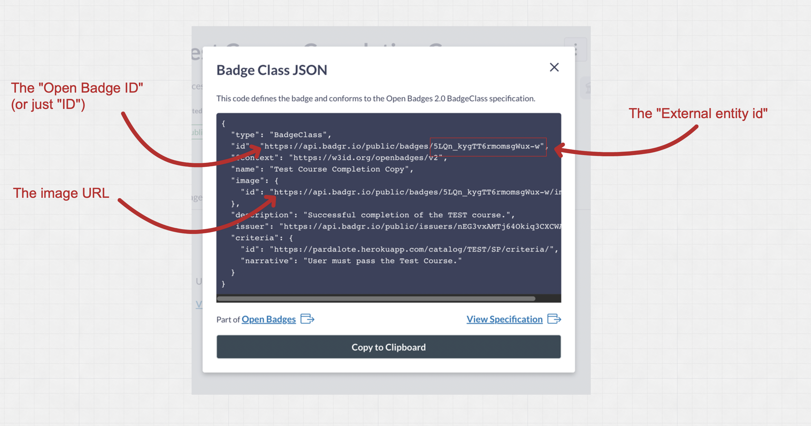

# Creating Badge Classes

You can create a badge class to represent an achievement in KinesinLMS. This badge class will be used to award a
badge to students who complete a course. (Only 'course completion' achievement badges are supported at the moment.)

In digital badges, each badge that a student can earn is represented by a "badge class." You can think of a badge class
as a template for a badge. It contains the information about the badge, such as the
name, description, and criteria for earning it.

When a student earns that badge, a "badge assertion" is made for that badge class. The badge assertion links the student to the achievement.

## Creating a Badge Class for Coures Completion

To create a badge for course completion, you'll need to have already set up a Badge Provider in the KinesinLMS admin
panel. If you haven't done that yet, see the [Badge Provider Integration](provider_integration.md) documentation.
You'll also need to have an account on Badgr.com and have set up an issuer for your KinesinLMS site.

Remember that each badge class is really composed of two parts:

- A badge class created in the external badge provider (e.g. Badgr.com)
- A badge class instance set up in KinesinLMS

## Creating the Badge Class on Badgr.com

To create a badge class on Badgr.com, you'll need to log in to your Badgr.com account and then create a new badge class
for your course. Make sure you create it under the issuer you used when creating the BadgeProvider in the previous step.

Here's how to do that:

- Log in to your Badgr.com account
- Naviate to the correct issuer
- Click the "Create Badge" button
- Add a name for the badge, an image (make sure you have the correct usage rights for the image), a description of the
  badge, and any earning criteria you want to add.

You also must add a URL that points to a "Criteria URL" that explains the criteria for the badge in more detail. Every
course in KinesinLMS has an automated, default "Criteria URL" that you can use for this purpose. The URL is in the
format `https://(your website url)/catalog/(course slug)/(course run)/criteria/`. Or you can create your own special
page with more criteria deatils and use that URL.

Once you've created the badge class on Badgr.com, you'll need to copy the information from the badge class into a badge
class on KinesinLMS.

Open the badge class on Badgr.com and click the "View JSON" button at the bottom of the page. This will show you the
badge class information in JSON form. You'll need to copy the information from a few fields in that JSON into a new badge class on KinesinLMS.

- The "id" of the badge. This is a full URL that represents the badge class. It will look something like
  this: `https://api.badgr.io/public/badges/(long badge class ID string)`
- The External Entity ID for the badge class. In Badgr's case, this is just the `(long badge class ID string)` portion of the "id" URL.
- The URL of the badge image. In Badgr's case, this is just like the Open Badge ID, with `/image` at the
  end. `<https://api.badgr.io/public/badges/some_long_badge_class_ID_string/image`

## Create the Badge Class on KinesinLMS

Now that you have a badge class created on Badgr and have gathered a few pieces of data, you need to create a badge class on KinesinLMS to represent it.

View the [Course Badges](../course_authoring_guide/course_badges.md) page in the "Course authoring guide" section for details on how to do this.

## Badge Criteria Page

As mentioned above, every course has a default "Criteria URL" that you can use to explain the criteria for passing the
course. You can use this URL in a "passed course"-type badge.

Any criteria added to the badge class will be shown in the "criteria" box on this page.

The page appears at the url: `https://(your website url)/catalog/(course slug)/(course run)/criteria/`.

## User Status

When the system is live and students are earning badges, you can see a complete list of earned badge assertions on the
admin panel: `https://(your app url)/admin/badges/badgeassertion/`
