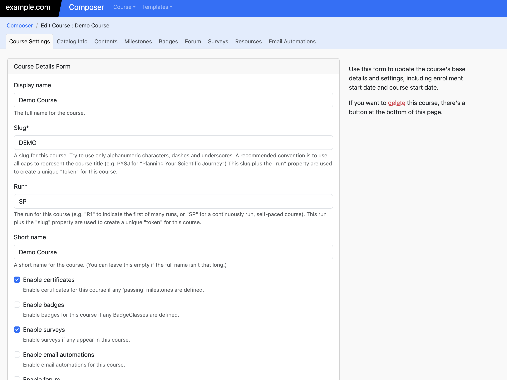

# Creating a Course

Creating a course involves a few basic steps:

  - **Course Information:** Create the initial course and add metadata like the course name and start date and time.
  - **Course Structure:** Create the course navigation structure: modules, sections and units.
  - **Course Content:** For every unit in the course, add one or more content "Blocks." These blocks will probably mostly be "HTML Content" or "Video" blocks.

## Create Course Information

On the main "Composer" page you'll see a button to "Create a New Course." If you click that, you'll be presented with a form for adding
basic information about your course, including enrollment start date and course start date.

Once you've added the initial information, Composer will present a new set of tabs that allow you to configure the course content,
as well as the various features availble in the course, such as badges, certificates, surveys or forum discussions.

