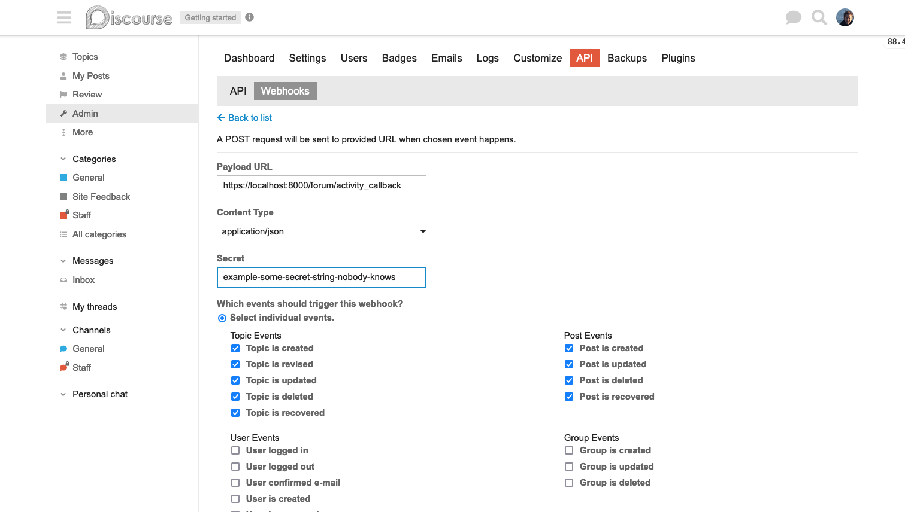

# Connecting KinesinLMS to the Forum Service

KinesinLMS is designed to support multiple forum providers, but currently only
supports [Discourse](https://www.discourse.org/). In this section we describe
how to configure KinesinLMS to use Discourse as its forum provider.

You should already have a Discourse instance running. The first step is to log
into Discourse as the admin user and set up the necessary keys and webhooks.

There are three main integration points between KinesinLMS and Discourse:

- An API connection for forum setup when a course is authored or loaded.
- SSO for logins so a user can move seamlessly between the KinesinLMS web app and the Discourse web app.
- KinesinLMS callbacks for forum activity. This allows Discourse to alert KinesinLMS of user post activity.

Here we set up these integration points. These instructions work for both a "production" Discourse server and 
one set up locally using e.g. Docker.

## General Settings

Before we start, make sure you have some basic "required" Discourse settings established.

Log in to your Discourse server. In the Admin > Settings 'required' tab, set all fields to the best of your ability.
In particular:

- Set site description to something like "My LMS site's forums"
- Set short site description to something similar.
- Search for "duplicate" and find the following two flags. Set them to checked (true):
  - `allow duplicate topic titles`
  - `allow duplicate topic titles category`

## API Key

KinesinLMS communicates with Discourse via API when doing things like creating Groups,
or creating new Categories, Subcategories and Topics for a newly added course.

To do this, it needs an API key to be created on Discourse and then saved in the KinesinLMS app.

When logged into the Discourse instance, go to Amdin > API and click the button 'New API Key'.


Set the following properties in the new API key form:

- Description: "(your LMS site name) integration"
- User level: "Single User"
- User: "my_admin_name" (or whatever your admin user is)
- Scope: "Global"

Then click the 'Save' button and copy the API key that is generated. This is the key
you'll need to set in the KinesinLMS environment variable `FORUM_API_KEY`.

If you're running locally, you can add that value to your environment directly, or to `_envs\_local\django.env`
if you're using env files.

If you're setting up for production, you'll need to use the mechanism for modifying environment variables provided by your host.
For example, on Heroku it would be something like `heroku config:set FORUM_API_KEY='(your key)' --remote (your remote name)`

## Discourse API Webhook

In addition to the API key, you also need to set up a webhook in Discourse so that it notifies your
KinesinLMS instance when a user posts something in the forum.

On the same Admin > API page in the Discourse admin, select the `Webhooks` tab and click the 'New Webhook' button.

Set the following properties in the form:

- Payload URL: "(your KinesinLMS instance URL)/forum/activity_callback"
    - If you're running locally, you'll use something like `http://localhost:8000/forum/activity_callback`
    - If you're setting up for production, it will be more like `https://(your KinesinLMS domain)/forum/activity_callback`
- Content Type: "application/json"
- Secret: A secret key to help verify the webhook.
    - Remember this string, as you'll set the same value in the `FORUM_CALLBACK_SECRET` environment variable in your KinesinLMS system.
- Select the following events:
    - All Topic Event checkboxes
    - All Post Event checkboxes
    - ( you can select other events, but you'll have to update the DiscourseService and DiscourseProvider class to handle them).
- At the bottom of the page:
    - make sure `Check TLS certificate of payload url` is checked
    - make sure `Active` is checked.



!!! note
    IMPORTANT! Before you continue, make sure you now set the secret you used above in the `FORUM_CALLBACK_SECRET` environment variable for your KinesinLMS instance and restart it. This is necessary so that the KinesinLMS instance can verify the webhook request is coming from Discourse.

## Discourse SSO

KinesinLMS uses Discourses' SSO feature so that users only have to sign in to KinesinLMS (Django) and can then access Discourse directly without another login. This allows us to show "Forum" as one of the items in the top navigation.

We need to set up SSO in Discourse however to make this work. Discourse used to call this feature "Discourse SSO" but now calls it "DiscourseConnect".

On the Admin > Settings page in Discourse, enter DiscourseConnect in the search box.

- Set the `discourse connect url` field to `https://(your KinesinLMS domain URL)/forum/sso`
    - If you're running locally, you'll use something like `http://localhost:8000/discourse/sso`
- Set the `site description` field to something like "KinesinLMS"
- Set the `discourse connect overrides bio` checkbox to checked
- Set the `discourse connect secret` field to a secret key for your KinesinLMS instance.
  - The secret key should be the same as the `DISCOURSE_SSO_SECRET` environment variable for your KinesinLMS instance.

!!! note
    IMPORTANT! Before you continue, make sure you now set the SSO secret you used above in the `DISCOURSE_SSO_SECRET` environment variable for your KinesinLMS instance and restart it. This is necessary so that the KinesinLMS instance can verify the webhook request is coming from Discourse.

### URL

Update your env variable settings so KinesinLMS knows the base URL for the Discourse app.

- If you're running locally, this will be something like `localhost:4200` (unless you modified the container to be something else)
- If you're setting up for production, it will be the URL given to you by Discourse.

Set the variable either in your shell or in your env variable file:

```bash
    DISCOURSE_BASE_URL="(Discourse URL)"
```

... and then restart your KinesinLMS system to pick up this change.

Ok! Now Discourse is connected. You can now manage the integration via the KinesinLMS Management panel.

## Plugins

You probably want to further customize Discourse to better integrate with your KinesinLMS-based system. You can use
Discourse "plugins" to help do this. We've found two plugins particularly useful for getting the forums to have a similar look
and feel as the KinesinLMS site.

- Brand Header Theme Component
- Category Headers theme component

To install these, go to Admin > Customize > Themes > Components and then click "Install."

See each plugin's docs for more information on cofiguring look-and-feel.
