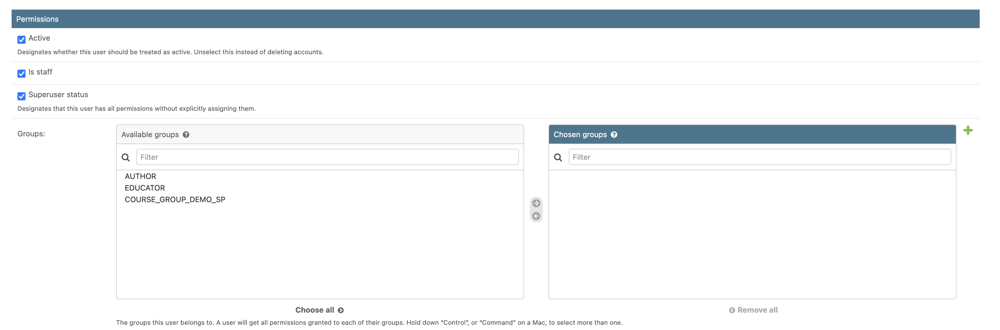
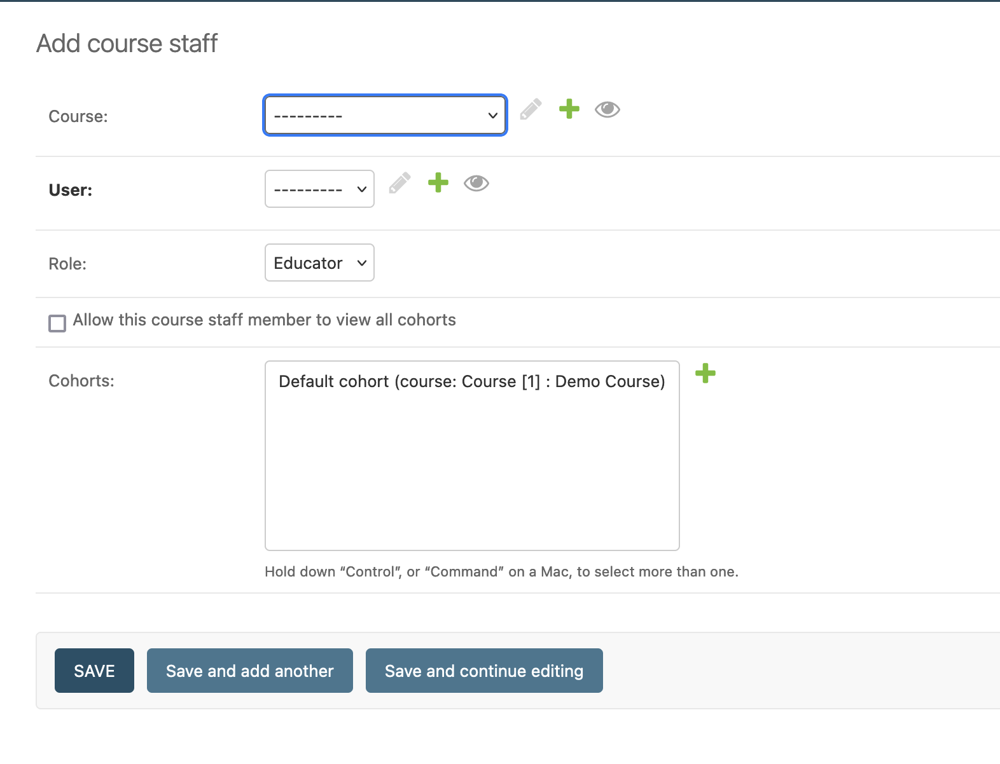
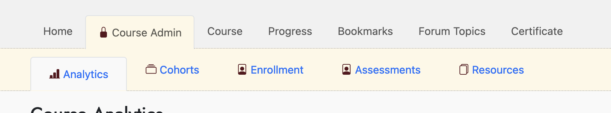

# Groups and Permissions Overview

KinesinLMS uses groups and permissions to enable and disable features and allow different users or groups access.
It also uses "switches" to turn site features on and off. This page describes how to leverage these tools to give users
access to different parts of the site.

KinesinLMS follows a simple approach to managing user groups and permissions, relying on the infrastructure provided by
Django for some tasks, and a special "CourseStaff" model for course-specific permissions.

Only a few groups, permissions and switches have been enabled. You're welcome to continue extending this default Django
setup to provide more granular control of who gets access to what (including new features you might add).

## Superuser and Staff

By default, Django provides each user with boolean flags for two properties:

- `Superuser` : User has all permissions available. Ultimate power.
- `Is staff` : User can access the Django admin panel for this site. Not ultimate, but very respectible power.

These settings are pretty important, and can only be edited via the Django admin panel...a user cannot change them by
logging into the site and selecting "My Profile" or "My Settings".

If you are running KinesinLMS, your user should already have "superuser" designation.

When you have users who you want to have access to the Django admin panel,
you can use the Django admin panel to check "Is staff" on their user after they registered.

!!! note
    Warning: Giving someone superuser or staff designation provides them with *a lot* of control over KinesinLMS. If the user
    really doesn't need that much power, try creating a new Group, updating KinesinLMS to provide access to a feature base on that group,
    and then add that user to the group. Only provide staff access if the user really needs it. And only give superuser access if
    they really, really, really need it.

## Groups and Permissions

Django comes with a built-in system for "groups" and "permissions." KinesinLMS leverages these to provide
access to certain features.

In Django, you can create permissions and assign one or more permissions to a group. Meanwhile, a user can be assigned to one or more groups,
so there are different ways one can assign permissions to that user.

In KinesinLMS, are two main Django "Groups" defined to help allocate permissions to the app's more protected features and content:

- `AUTHOR` - A group for users who need to be able to author content using the 'Composer' feature
- `EDUCATOR` - A group for users who have special 'educator' rights, like viewing analytics in a course or viewing assessment answers in the learning library.

KinesinMLS also creates a group for every course you create, giving it the standardized name: `COURSE_GROUP_(course slug)`. For instance, if your
course's slug is DEMO_SP, the group will have the name `COURSE_GROUP_DEMO_SP`. Any user that enrolls in a course will be added to that course's group.

### The "AUTHOR" Group

An "Author" is a user with permissions to author courses. This means they get access to Composer via the Composer navigation
item in the top nav.

!!! note
    A user **must** be in the `AUTHOR` group to access "Composer".

### The "EDUCATOR" Group

An "Educator" is a user with permissions to view "educator"-level information, at the site level or for courses.
A user must be in this group to view the "Educator Resources" section of the site.

However, adding a user to the "Educator" group is not enough to grant them access to educator material in a course.
You must then create a "CourseStaff" instance for each course the educator should be able to access. More on that next...

!!! note
    A user **must** be in the `EDUCATOR` group to access educator resources in a course and certain data in the Learning Library.

### Assigning Groups

To assign a user to a group, you use the Django admin panel, find the user in the Users list and select the user for edit.

In the User edit screen, there's a "Permissions" section about halfway down the page for adding and removing groups for a user.
Move the groups you want to assign to the user from the "Available groups" panel to the "Chosen groups" panel.

When a user is in a group, they get all the permissions provided to that group.

## CourseStaff Model

A user needs to be in the `EDUCATOR` group to access educator-specific information for a particular course. However,
that in itself is not enough. You may want a user to be able to access educator material in only some courses.

Therefore, to access educator views and resources for a particular course, a user must also
be assigned to a particular course as "Course Staff."

This granularity allows the admin to provide educator access on a course-by-course.

The site admin can use the Django admin panel to add a CourseStaff instance for a user and a course.
There is currently only one role type for a CourseStaff, but the model could be extended to support more
role types in the future (with a user getting one or more roles, depending on their access needs).

When a user is assigned as course staff to a course, they can then view the course admin tab for a course, and
access the information provided in that section.

