# Qualtrics Survey Integration

If you have succesfully set up a SurveyProvider in KinesinLMS with information about your Qualtrics account,
you can now start adding surveys you've created in Qualtrics into your courses.

This section shows you how to do this in two sections below :

1. Prepare a survey in Qualtrics so that it
   1. registers user information and
   2. calls back to KinesinLMS when complete
2. Add this survey to a course using the "Survey" block in Composer.

## Preparing a Survey In Qualtrics

The first step to integrating a survey from Qualtrics into your course is to create the
survey in Qualtrics. Details on creating surveys in Qualtrics is outside the scope of this documentation,
but it's not very difficult and if you haven't done it before it shouldn't take too long to get started.

Once you've got a survey ready, there are a few configuration steps you'll need to perform to your survey to:

1. get the survey to accept a user identifier from KinesinLMS, and
2. create a "WebService" workflow item to call back to KinesinLMS once a survey has been completed.

### Adding the User Identifier

When a survey is embedded in a course, KinesinLMS will send the student's anonymous ID to Qualtrics as a GET variable
in the survey URL when it shows the survey in an iframe within a course unit. (It's better to
use an anonymous ID than passing around identifiable information like email,
but you could update KinesinLMS to send email or username.) The variable name is `uid`, so the end of
the url will look like `?uid=abca32-1252...`.

So we need to configure the Qualtrics survey to accept and store this user information. To do this,
go to the "Survey" tab and then click the "Survey Flow" option in the left nav.

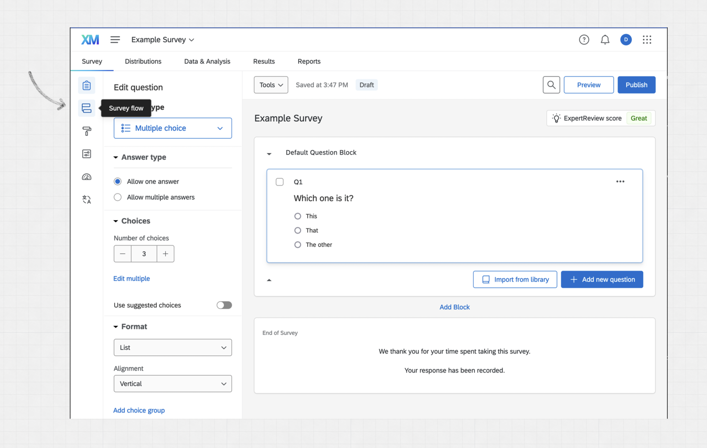

You'll see the default survey flow, with an option to "Add a New Element Here". Click that link.

Select the "Embedded Data" option and enter "uid" into the field displayed after clicking.

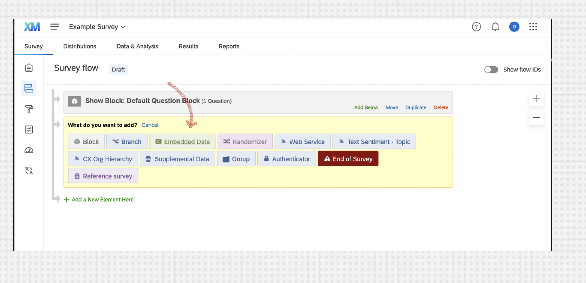

You should now see something like this, which indicates Qualtrics will store the incoming
`uid` field as embedded data as part of any survey completion.

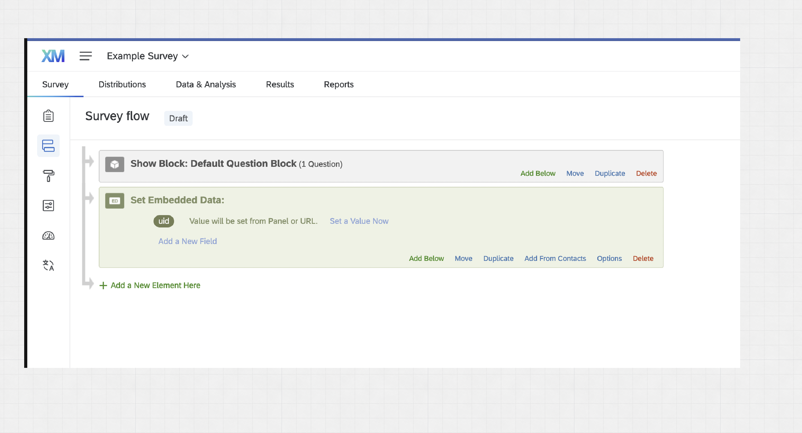

Don't forget to click "Apply" at the bottom of the page.

### Adding the Callback Workflow

Another nice Qualtrics feature that KinesinLMS supports is getting notified when a user has completed a survey.
KinesinLMS does this by accepting a "WebService" call from Qualtrics, which essentially means KinesinLMS listens for
a particular automated web request from Qualtrics that indicates a survey has been completed by a user.

So if we want KinesinLMS to know when surveys are completed, We need to configure both the individual survey and
KinesinLMS to support the web callback.

To set up our example survey to issue the web callback to KinesinLMS, we'll select the "Workflows" tab
in our Qualtrics survey. (Note that you need a certain level of permissions in Qualtrics to have access to workflows,
so if you don't see the tab, contact your account owner to find out more.)

When in workflows, click the "Create a Workflow" button and select "Start when an event is received" from the dropdown.

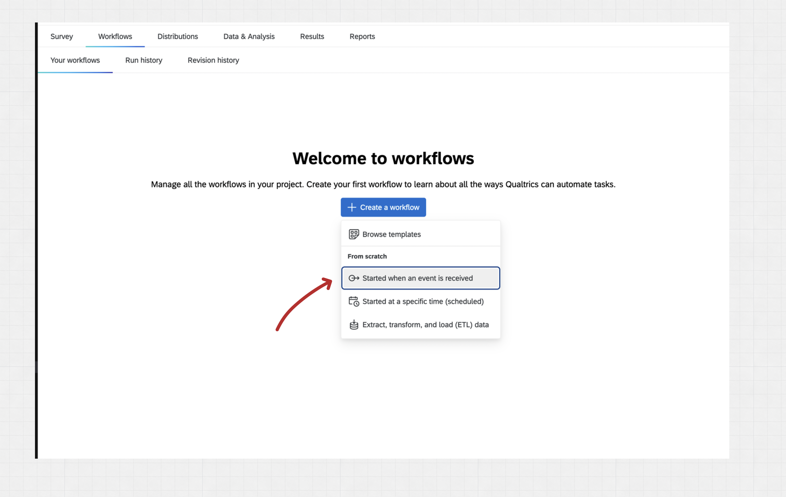

Then select "Survey response" for the workflow type we want to implement:

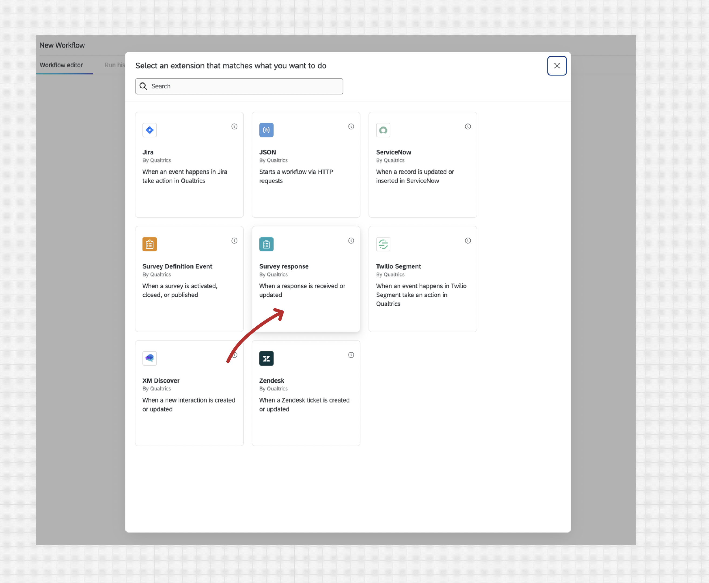

Accept the default settings for this item ("Newly created items" should be checked) and click "Finish."

At this point we have a workflow that will kick off whenver someone generates a survey response. Now we need
to tell Qualtrics to make a request to the KinesinLMS server to let it know what happened.

Click the "+" icon beneath the "Survey response" item and then click the "Add a task" option in the dropdown.

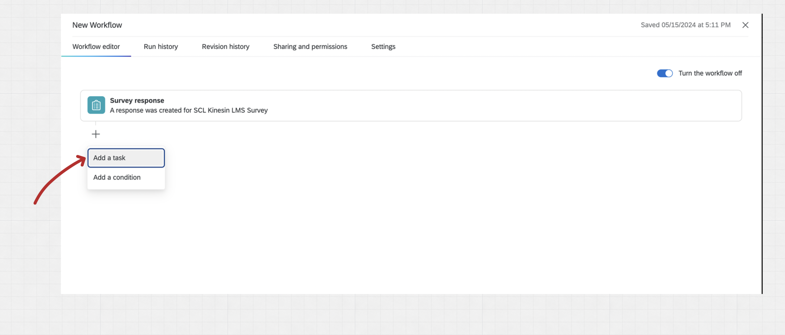

There are a lot of task available, but we're looking for one named "Web Service". Enter "Web" into the filter field
to make it easier to find...

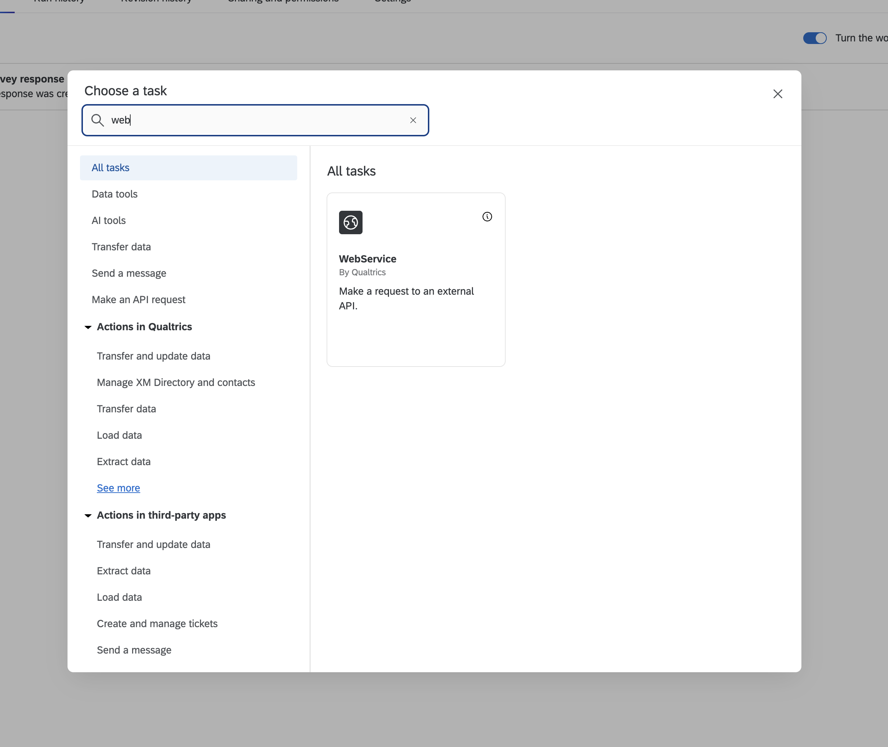

Select the "Non-authenticated" option. (We'll still pass along a secret we'll set up further below, to make sure only Qualtrics web requests
are accepted)

In the next step we'll configure the WebSevice item to call our KinesinLMS system.

For the "Rest" option, change the type to "POST" and add the URL of your KinesinLMS system along with the `/surveys/student_survey_complete_callback` route.
So if your domain name was example.com, the URL you'll enter will look like `https://example.com/surveys/student_survey_complete_callback`.

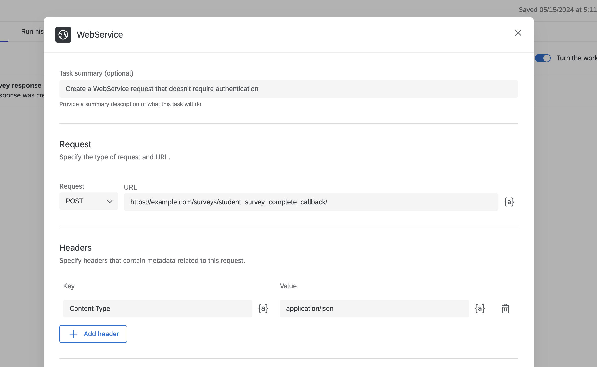

Now we want Qualtrics to send four peices of information to our system when a survey is finished:

- the ID of this survey response
- a secret code
- the survey ID
- the user's anonymous ID

We use the "Body" section to do that. Select "Json" and "key value pairs" and click the "Add key-value pair" button four times to add four fields.
Then configure them as shown below.

- The secret can be whatever you want, but it has to be the same for every survey in the course. We'll use this same value when we configure KinesinLMS next.
- It's strange that Qualtrics makes it hard to find the actual ID of the survey, but the easiest way is to just look in the URL of the Qualtrics site when editing the survey...it's the value that starts with `SV_`

Click "Save"

### Getting the "Anonymouse Link" for Your Survey

One final piece of information: you'll need the "anonymous link" to the survey when you configure it in KinesinLMS. You can get the survey's anonymous link
from the "Distributions" > "Anonymous Link" page in Qualtrics when editing the survey. Copy and hold on to that URL for the next step.

Alright! That concludes the Qualtrics side of the configuration. You should see your "WebService" workflow item now configured in your Workflows tab:

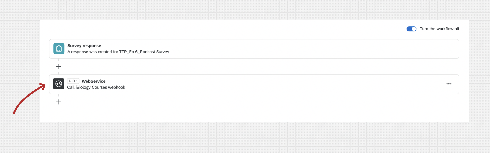

Next step, we'll configure KinesinLMS to accept these callbacks.

## Add a Qualtrics Survey to a Course

Now that you have your survey configured in Qualtrics, you can add this survey to the course. This is a two-step process:

- **add a "course survey"** to the course so the survey is available to blocks in the course.
- **add a survey block** where you want the survey to appear. You can have the same survey appear in multiple places in a course.

### Adding a "Course Survey"

To add a survey to a course, you create a "Course Survey" for your course in Composer.

First, open your course in Composer and select "Surveys":

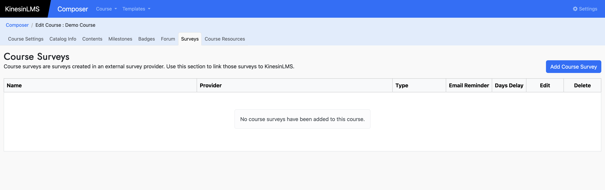

Click "Add Course Survey" and enter the information for your survey in the form.

Set the "Survey ID" field to the Qualtrics ID for your survey, and the "Url" field to the anonymous link you copied from Qualtrics in the earlier step.

Your form should look something like this...

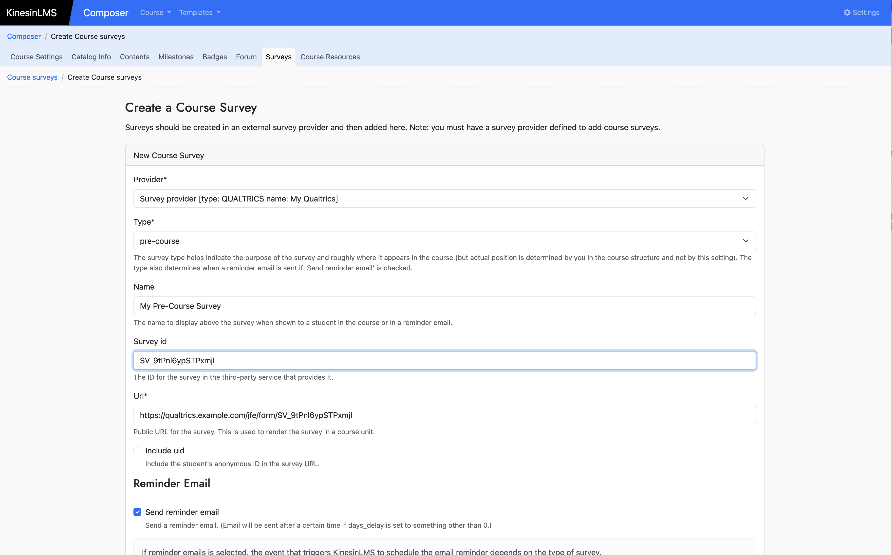

KinesinLMS can send an automated email to a user to remind them to take the survey. The email will contain a link to the unit the survey first appears in.

If you want this feature, select "Send reminder email."

If "send reminder email" email is selected, the event that triggers KinesinLMS to schedule the email reminder depends on the type of survey.

- **pre-course:** Reminder email is scheduled when a student enrolls in a course.
- **basic:** Reminder email is scheduled when student first views a unit with the survey.
- **post-course:** Reminder email is scheduled when a student completes a course.
- **follow-up:** Reminder email is scheduled when a student completes a course.

Furthermore, if "days delay" is also defined, the reminder email will be sent after the specified number of days after the email is scheduled.

Now that your survey is configured for your course, you can add it to a certain unit in the course contents.

### Adding a Survey Block

Navigate to the "Contents" tab and the unit in your course where you want the survey to appear.

Add a "Survey" block type. The survey block panel will allow you to add:

- A header for this block
- HTML content (if you want content directly above the survey)
- A survey

The dropdown control for survey should show all surveys configured for the course. You can show the same survey in multiple places.

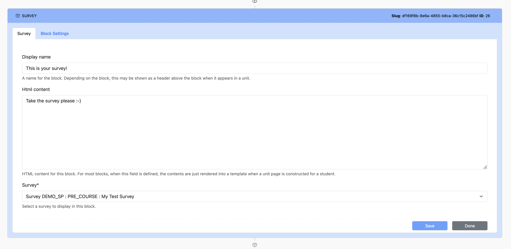

Save your new survey block and click "View in Course." You should see your survey in the course unit! Note that some browsers (e.g. Firefox) by default
do not show iframe content. In this case, you might want to use Chrome or another browser that does.

KinesinLMS does provide a link to directly access the survey for students whose browsers do not show iframes.
