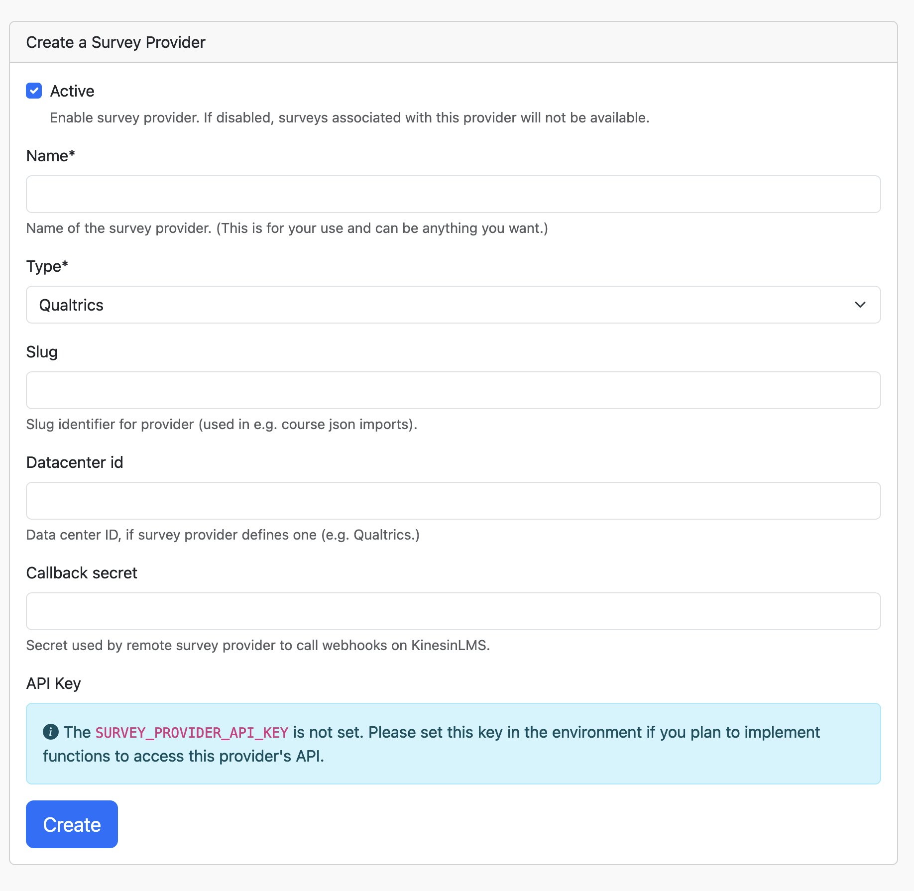
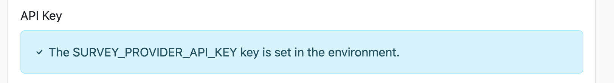
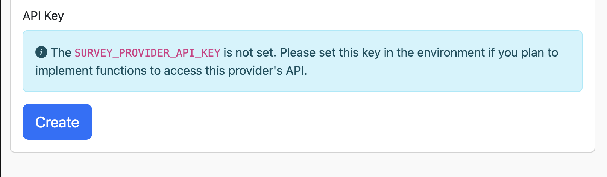

# Survey Providers

The first step to getting surveys integrated into your course is to create a link to an external service where you've authored
your surveys. You create this connection by creating a "Survey Provider" instance in KinesinLMS via the management panel.

Qualtrics is the only service currently supported, so in this section we will create an SurverProvider instance for Qualtrics.

## Creating a Survey Provider

To go to the Survey Provider management page, select "Survey Providers" from the "Management" pull down in the top navigation.

Once on the Survey Provider management page, click the "Add Survey Provider" button, which will display a dialog for entering the provider's information.

Fill in the dialog fields:

- **Name:** You can use any name here, this is only for reporting purposes...e.g. "My Qualtrics Account"
- **Type:** Only Qualtrics is allowed, so not much of a choice here.
- **Slug:** You don't have to add a slug, but it's useful in things like event tracking or import/export (if you don't enter a slug, it will be created for you by slugifying the name).
- **Datacenter id:** This is the Qualtrics datacenter assigned to you by Qualtrics.
- **Callback secret:** This can be any string of characters you want. You will use this string when setting up a Qualtrics server so that Qualtrics sends the secret to KinesinLMS anytime a survey is completed.

## Setting the Qualtrics API Key

Qualtrics provides an API for advanced interactivity with surveys and other platform features.
KinesinLMS does not leverage these APIs, but you could extend the existing code to leverage
to do so.

If you intend to add code to access the Qualtrics API, you'll need to store the API key for your
Qualtrics account in KinesinLMS. It's best to store these kinds of keys in the environment, rather
than the database, so KinesinLMS will look for this key in the environment variable `SURVEY_PROVIDER_API_KEY`.

Although it doesn't currently use the Qualtrics API Key, KinesinLMS does indicate whether you have configured it
or not in the environment, letting you know when it's set:

...or when it's not set:

