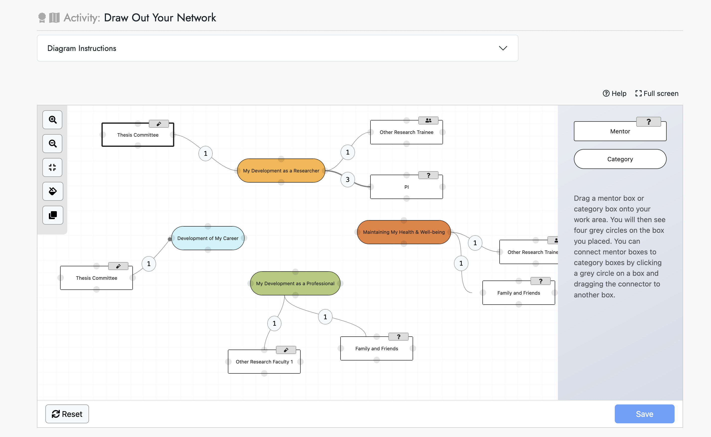
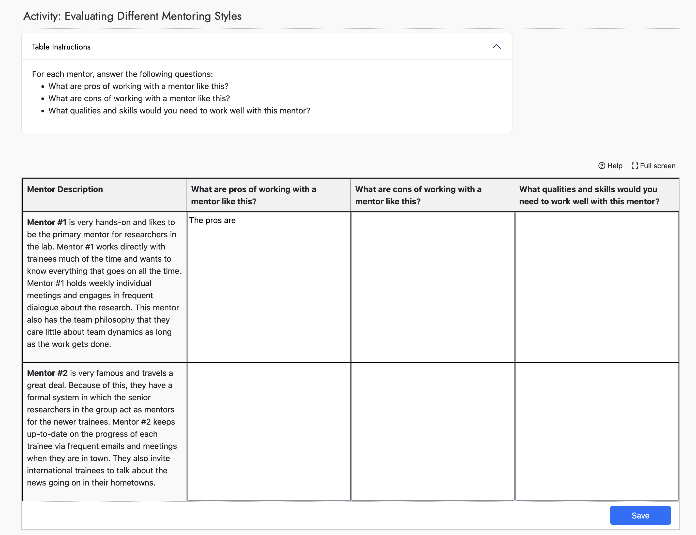

---

title: 'KinesinLMS: A Simple and Practical Learning Management System for (Very) Small Teams'

tags:
  - LMS
  - Learning Management System
  - Online Courses
  - Django
  - Python
  - e-Learning

authors:
  - name: Daniel McQuillen
    ordid: https://orcid.org/0009-0004-6149-4400
    affiliation: 1
  - name: Alexandra M. Schnoes
    orcid: https://orcid.org/0000-0003-2727-7758
    affiliation: 2

affiliations:
 - name: McQuillen Interactive Pty. Ltd.
   index: 1
 - name: Science Communication Lab
   index: 2

date: (Draft)

bibliography: paper.bib

---

# Summary

``KinesinLMS`` is an open-source, Django-based Learning Management System (LMS) designed to be a straightforward and easily extendable platform for authoring, managing, and delivering online courses. The application was initially developed by McQuillen Interactive Pty. Ltd for the non-profit Science Communication Lab (SCL) to serve as the online course delivery platform for the iBiology Courses project [@Schnoes2024]. It has since been refactored into an open source project. The application is particularly suited to teams that 1) want to manage and run their own LMS using open-source Python code, 2) want to build something novel and domain-specific within that LMS, and 3) only have one or two developers available to do it.

We present ``KinesinLMS` as a simple, open-source, Django-based LMS suited to custom e-Learning projects by small teams. The application includes course authoring, delivery tools, and integrates with common external services for features like badges, forums, email automation, and survey management.

We named the project after kinesin, the small but powerful molecular motor protein discovered by Dr. Ron Vale and colleagues. Dr. Vale is a member of the SCL Board of Directors and the founder of iBiology and iBiology Courses.

# Software

-

# Statement of Need

Many criteria can influence the selection of a Learning Management System (LMS). In the literature, there are several examples of the criteria that can be used to choose an LMS appropriate to one’s particular situation [@sanchez:2024; @spirin:2022]. However, it is rare that these criteria listed concern the technical complexity of the underlying software. Seldom do they rank the simplicity and approachability of the system's architecture or codebase. Yet these factors significantly affect a development team's ability to deploy, manage and extend an LMS to support project goals. In those papers investigating criteria for selection of an LMS, developer concerns are markedly absent [@sanchez:2024; @spirin:2022].

If an LMS is closed source, or open-source but hosted and managed by an external group, and the team using the LMS does not intend to modify the code or data models in a fundamental way, developer concerns are indeed negligible. However, in cases where the project requires unique question/assessment types or other deviations from the chosen LMS’s standard features, look, or functionality, the complexity of the underlying LMS code, and the resources needed to change and maintain the LMS become critical.

As web applications become more complex, industry experts are urging developers to both critically assess and work to minimize that complexity. As Ruby on Rails creator Heinemeier Hansson extolled in a recent interview, "Simpler. Simpler. We've gone through 40 years in the desert…for necessary but temporary complexity…we built bridges to get from A to B, and now we're at B and people haven't realized the bridges aren't necessary…individual programmers can understand the entire system they're working on.” [@HeinemeierHansson2024]

``KinesinLMS` is designed to be straightforward, providing "just enough" LMS for teams conducting innovative e-Learning services and research: enough features to start building something novel, including working examples of ways to implement rich interactivity, but not so complex the developer is lost in the churn.

To be sure, an LMS -- or any web application -- should leverage newer, more complex technologies when the user interface or experience calls for it; in these cases build-heavy tools like Angular or React are hard to avoid, even though they bring along a (very) long list of concepts and Node dependencies when integrated into a project. In this regard, ``KinesinLMS` espouses moderation, scoping complexity to only the places where it's required, rather than blanket inclusion across an entire application.

# Story of the Project

``KinesinLMS` started as a home-grown LMS to support iBiology Courses, a National Institute of Health-funded project (grants #5R25GM116704 and #1R25GM139147) that provides full, free online courses to life science trainees. [@Schnoes2024]

In the first iteration of the iBiology Courses project, the research team ran a self-hosted, highly-customized version of Open edX. However, the high complexity in maintaining and modifying the Open edX system became a significant problem for the one-person development team. The analytics portion of the project was practically unusable. After a fruitless search for a simpler, open-source LMS that met the project's requirements, SCL authorized the development of a new,  custom LMS based on Django. Over the last three years, this system has successfully supported more than 10 fully-featured courses and over 8,000 graduate and postdoc students with 99.99% uptime and overwhelmingly positive reviews, while at the same time greatly increasing the velocity with which the team can make updates and add new features.

In 2023, the NIH awarded the project a supplemental grant to transform and generalize the iBiology Courses LMS into a generic, open source system that other teams in science education can use for their e-Learning research efforts. This rewrite included a large number of improvements as well as developer-focused documentation on setting up and managing the system.

# Implementation Overview

``KinesinLMS` follows standard conventions established by the Django team and further extended by the "Django Cookiecutter" project [@RoyGreenfield2024]. It uses one PostgreSQL database for persistence, Redis for a cache, and Celery for asynchronous tasks. Bootstrap 5.3 is used for a reliable, responsive, and accessible user interface. Django is based on the well-established straightforward Model-View-Template pattern, which makes it easier to understand the application's existing components as well as add new features.

Complex features that would be hard to manage internally are offloaded to external resources. The developer is meant to set up these 'providers' via the ``KinesinLMS` dashboard. The providers are meant to be generic so that the developer can write a subclass for a particular commercial service. In the initial implementation, forums are hosted on Discourse, badges are hosted in Badgr.com, surveys are hosted on Qualtrics, and email automations are hosted in ActiveCampaign.

For rich user interfaces, two different libraries are used: HTMx and React. Simple interactions are handled by HTMx, a JavaScript library that reintroduces the concept of "hypertext" to achieve rich interactivity with less overhead than the more involved client-side frameworks like React, Angular, or Svelte.[@Gross2024]. Meanwhile, in places where the user interface complexity is very high, such as a custom drag-and-drop node diagram tool, React is used.

The initial implementation of ``KinesinLMS`` has two examples of React-based assessments that support higher levels of interaction: the "DiagramTool" and "TableTool". Both tools are highly configurable to support different pedagogical goals. In the figures below, the "DiagramTool" and "TableTool" are shown in the context of a course on mentorship in scientific research communities.  Each tool communicates with the ``KinesinLMS`` server via a simple API implemented with the Django Rest Framework library.

As a standard Django application, ``KinesinLMS` can be deployed to commercial hosting sites or a self-owned server. The documentation describes deployment steps for the popular Heroku service, but any hosting platform suited to standard Django deployments (such as Fly.io or Render.com) could be used.

# Acknowledgements

Work on KinesinLMS was supported by the National Institute for General Medical Sciences grants #5R25GM116704 and #1R25GM139147.

# References
